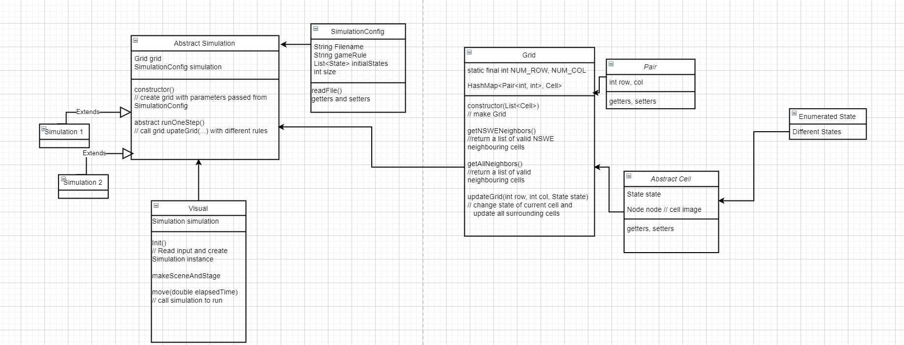
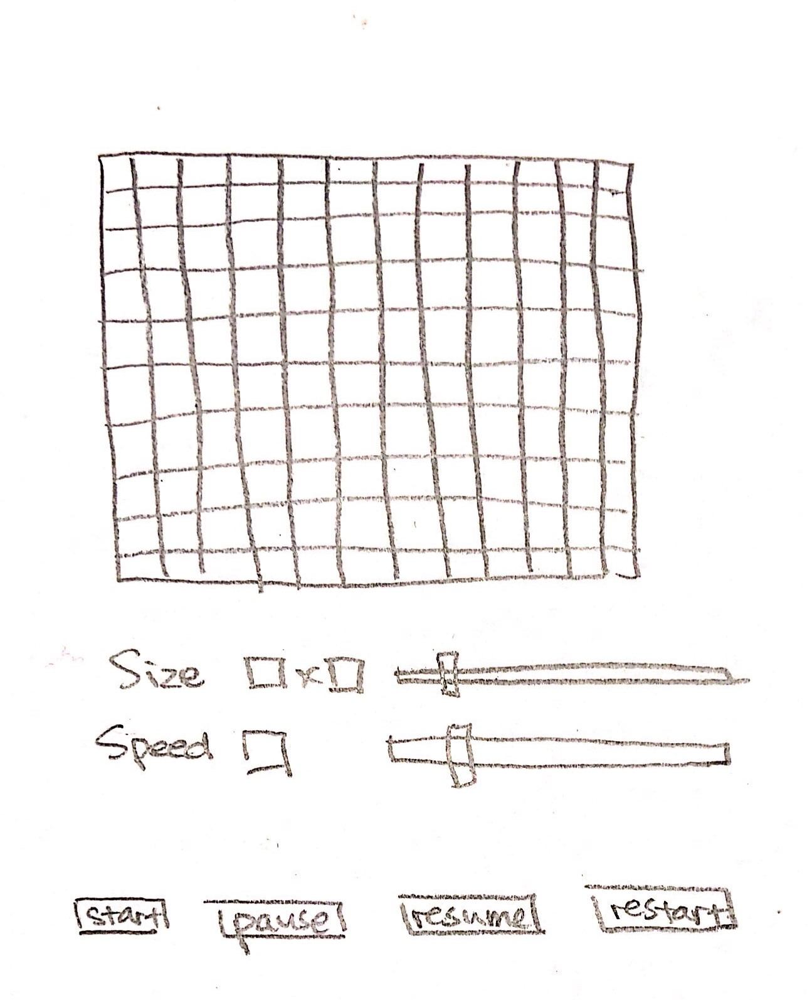

# ca.model.Simulation Design Plan
### Team Number: 
14
### Names
Hannah Taubenfeld, Tharun Mani Raj, Cady Zhou

## Introduction

* Problem: We are trying to solve the problem of creating a Cellular Automata (CA) simulation that obides by a set of rules and updates the states of each cell in a grid based on those rules. 
* Design Goals: The program will be most flexible in the rules, the original states of each cell, as well as the grid size. The overall goal of this project is to create a structure for a simulation that is general enough that it can apply to many simulations, but specific enough in that the right rules are followed. Additionally, the project will be designed in a way that each simulation takes in a XML file. 
* Primary Architecture: In this project, the code in the controller is closed, while the code in the ca.view is open. In the model, depending on the class, the code is either open or closed. 
* High-level Design: This project is split up into three main parts - Model, View, and Controller. The model, creates the grid based on the given size and is able to access a single cell in the grid, retrieve its current state as well its neighbors' states. The controller, creates the simulation and bases the information on an XML file which is read in at the start of the simulation. This section creates the game and reads in the size, states, and rules of the grid. Finally, the ca.view, sets up the visuals of the simulation. It is here that the visuals of each grid change during each step.  


## Overview


## User Interface
The user interface should contain
- A grid representing current states of individual cells
- A slider for adjusting the size of grid
- A slider for adjusting the speed of simulation (if applicable)
- Buttons for start, pause, resume and restart the simulation



## Design Details
- Abstract ca.model.Simulation
    - Description: This component creates the grid of the specified size as well as takes the output of each step. In the step, the states of each cell are changes and the visuals are updated.
    - Justification: This is an abstract open class. You can have multiple simulation games extended from this class. This was created to be more general and thus we are able to create many simulations. 
- ca.model.Grids.Grid
    - Description: This components creates a grid and stores the initial states in a map with their indices in the grid. Additionally, this grid is able to get the neighbors' initial state. 
    - Justification: This is created in another class as a means to create different grids in each step and alternate grids depending on the simulation that is running. This will be an open principle. In the future, we can make the grid interactive by changing the size. 
- ca.model.Cell
    - Description: This component takes the intial state of the cell and returns it. It also sets a color for the cell depending on this state. 
    - Justification: This was created separately from the grid in order to break down a larger component, the grid, into smaller components, the cell. By making this abstract, we can extend in such a way that we can make each cell a node that can use an image or shape.
- Visual
    - Description: This component creates the visuals that are shown to the user. Here, the scene is set and the step function is called on. Additionally, the cells are updated depending on the rules and their states. 
    - Justification: This is an open component. The extension of the visuals can be to adjust features such as speed of step and other parameters that affect different simulations. 
- SimulationConfig
    - Description: This component reads all the important and essential information from the XML file. It is here, that the file is broken up into its parts that will then be used throughout the project. 
    - Justification: This is important because all the other classes and function rely on the input of this class. It can be extended by using the information to create a simulation. 


## Design Considerations
#### Asumptions and decisions discussed in length:
* XML file format: We have decided as a team, that the XML files will take the form of: grid size given as integers, states given as a list of integers, rules given as strings, and colors given as strings too. These assumptions and standards are important because it will affect how the XML file is read in. Additionally, the format of each of these aspects of the simulation, must be the right structure in order to be handled properly throughout the classes in the project. 

* ca.model.Grids.Grid format: We have decided as a team, that the UI will be a grid and use different colors to represent the states of each cell. This grid format will make it easier to iterate through each cell and check the neighbors. The visuals as well as the model are dependent on this format. 

#### Alternative Design 
Our team had a long discussion about the data structure to store cells in ```ca.model.Grids.Grid.java```. Currently our team decide to use an hashMap and create another ```ca.model.Pair``` class to store the position of cells. An alternative design our team came up previously was to store cell states with an arrayList or 2D array. For the alternative design,
- *pros:* easier to implement
- *cons:* has a slower access time and needs more complicated logic to retain neighbors


#### Use Cases
- *Apply the rules to a middle cell:* 
    - ca.model.Simulation.java calls ca.model.Grids.Grid.getAllNeighbours, checks for the states of the neighbouring cells, and sets the new state of the cell based on the simulation rules located in SimulationConfig.java
- *Apply the rules to an edge cell:*
    - ca.model.Simulation.java calls ca.model.Grids.Grid.getNSWENeighbours, checks for the states of the neighbouring cells, and sets the new state of the cell based on the simulation rules located in SimulationConfig.java
- *Move to next generation:*
    - ca.model.Simulation.java sets the new state of a cell and updates its neighbors according to rules. This will be done in ca.model.Simulation.runOneStep recursively with a queue. View calls .update and refresh the entire gird. 
    
- *Set a simulation parameter:*
    - The readFile function is called (in the SimulationConfig.java class) which will read the XML file passed into values into instance variables. By using getters and setters, ca.model.Simulation can get these values. 
    
- *Switch Simulations:*
    - When the user clicks on the "Run a new simulation" button on the window, a new window pops up and the user selects a new XML file to load. The ca.model.Simulation class creates a new instance of the Wator.java according to values from SimulationConfig.java. A new ca.model.Grids.Grid is initialized in the Wator.java class by making an instance of the ca.model.Grids.Grid.java class and stores the grid as one of its attributes. The View class displays the new scene based on this new simulation instance.
    
## Team Responsibilities

 * Hannah Taubenfeld
     - Implement ```Main.java``` (View)
     - Implement 1-2 non-abstract ca.model.Simulation classes

 * Tharun Mani Raj
     - Implement ```ca.model.Cell.java```, ```ca.model.Grids.Grid.java```, and ```ca.model.Simulation.java```
     - Implement 1-2 non-abstract ca.model.Simulation classes

 * Cady Zhou
      - Implement ```Simulator.java``` and ```SimulationCofig.java```
     - Implement 1-2 non-abstract ca.model.Simulation classes
